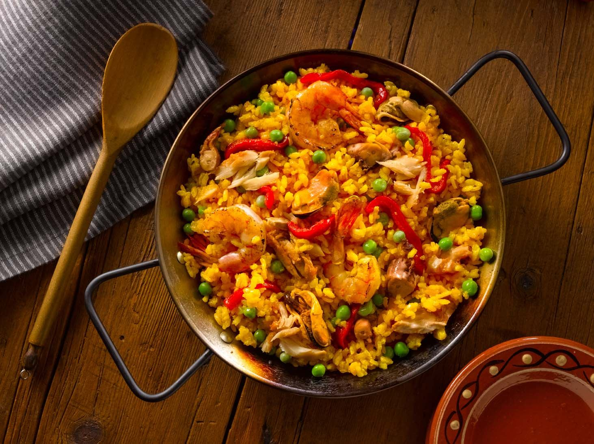

# Receta de Paella
La paella es un plato tradicional español, especialmente de la región de Valencia. Es conocida por su rico sabor y su combinación de mariscos, carnes y vegetales. A continuación, te mostramos cómo prepararla.

## Ingredientes
- **Arroz** (400 g)
- **Pollo** (300 g, troceado)
- **Conejo** (300 g, troceado)
- **Gambas** (200 g)
- **Mejillones** (200 g)
- **Calamares** (200 g, en rodajas)
- **Pimiento rojo** (1, cortado en tiras)
- **Judías verdes** (150 g)
- **Tomate** (2, rallados)
- **Aceite de oliva** (50 ml)
- **Azafrán** (unas hebras)
- **Caldo de pollo o pescado** (1 litro)
- **Saldo** al gusto
- **Pimienta** al gusto

## Preparación
1. ***Calienta el aceite de oliva*** en una paellera grande y sofríe el pollo y el conejo hasta que estén dorados.
2. **Añade el pimiento rojo** y las judías verdes, cocinando hasta que estén tiernos.
3. **Agrega los calamares** y sofríe durante unos minutos, luego añade el tomate rallado y cocina hasta que se reduzca.
4. **Incorpora el arroz** y sofríe ligeramente. Añade las hebras de azafrán y mezcla bien.
5. **Vierte el caldo** caliente y distribuye bien el arroz. Cocina a fuego alto durante 10 minutos.
6. **Coloca las gambas y mejillones** sobre el arroz. Reduce el fuego y cocina otros 10 minutos o hasta que el arroz esté en su punto.
7. **Deja reposar la paella** tapada durante 5 minutos antes de servir.

## Consejos
- Asegúrate de no remover el arroz una vez añadido el caldo para lograr la textura perfecta.
- Puedes añadir otros mariscos como almejas o langostinos para darle más sabor.

**¡Disfruta de tu paella casera!**
