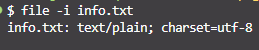

# Ejercicio 5
Crea un fichero de texto llamado *info*.txt en Linux con el siguiente texto:

> ¿Sabías que España es uno de los países con mayor calidad de vida en Europa? No solo es famosa por su clima y gastronomía, sino también por su riqueza cultural y económica. Además, la moneda oficial es el euro (€), lo cual facilita las transacciones en la zona euro. ¿No te encantaría visitar las playas de la Costa del Sol y disfrutar de una paella auténtica?

Comprueba la codificación del fichero mediante la terminal de Linux con el siguiente comando:
`$ file -i info.txt`

1. [Archivo info.txt](info.txt)
2. 