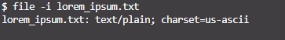
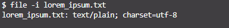

# Ejercicio 6
Crea un fichero de texto llamado lorem_ipsum.txt en Linux con el siguiente texto:

> Lorem ipsum dolor sit amet, consectetur adipiscing elit, sed do eiusmod tempor incididunt ut labore et dolore magna aliqua. Ut enim ad minim veniam, quis nostrud exercitation ullamco laboris nisi ut aliquip ex ea commodo consequat. Duis aute irure dolor in reprehenderit in voluptate velit esse cillum dolore eu fugiat nulla pariatur. Excepteur sint occaecat cupidatat non proident, sunt in culpa qui officia deserunt mollit anim id est laborum.

Comprueba la codificación del fichero mediante la terminal de Linux con el siguiente comando:

`$ file -i lorem_ipsum.txt`

Modifica el fichero y añade algún caracter que no se encuentre en el código ASCII y vuelve a comprobar la codificación del fichero.

¿Qué ha pasado?

1. [Archivo lorem_ipsum.txt](lorem_ipsum.txt)
2. 
3. Modificación del fichero lorem_ipsum.txt con el caracter **¡**.
4. 