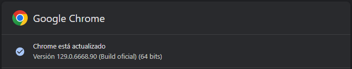
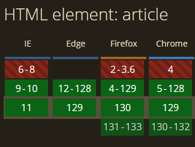
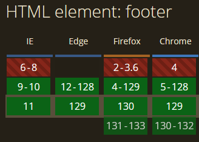
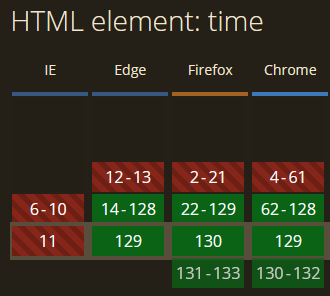

# Ejercicio 2
Los estándares HTML 5.1 y HTML 5.2 introducen etiquetas HTML nuevas. Busca dos o tres etiquetas HTML de cada estándar 5.1 y 5.2 y comprueba si tu versión de navegador Google Chrome las soporta. Para comprobar si tu versión del navegador soporta las etiquetas HTML usa la siguiente URL:
[caniuse.com](https://caniuse.com/)

### Versión instalada de Chrome:

| Etiqueta | Versión |
|   ----   |   :---:   |
| Article  |  |
| Footer   |    |
| Time     |     |